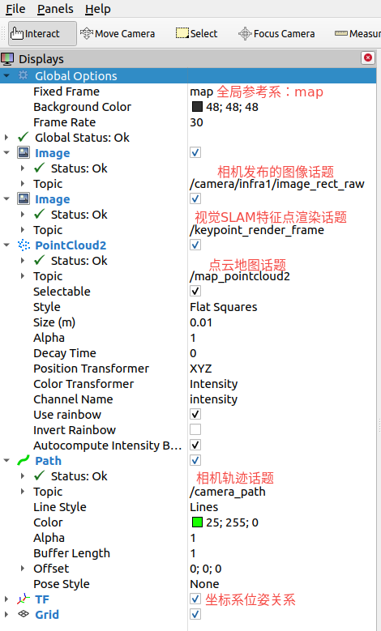

[English](./README.md) | 简体中文

## 视觉SLAM算法

### 功能介绍

SLAM一般指即时定位与地图构建，即时定位与地图构建（Simultaneous Localization and Mapping，简称SLAM）。 众所周知，视觉SLAM领域最突出的工作非ORB-SLAM3莫属。ORB-SLAM3的优点和特性在此不再赘述。TogetherROS为了方便开发者开发基于视觉SLAM的应用，集成、改进和优化了ORB-SLAM3。
1. 集成和适配SuperPoint特征提取模型以优化视觉SLAM前端图像特征提取的鲁棒性，并降低CPU的运行负载。
2. 使用ROS2封装了ORB-SLAM3的点云和位姿信息发布以及图像和IMU的订阅。
3. 增加了Track异步接口，分离特征提取和特征点跟踪为不同的线程，提高了处理帧率，有利于实际的工程应用。
4. 新增词袋库创建程序，帮助开发者构建自己的词袋库。

本章节以ORB-SLAM3作为建图算法，使用EuRoC开源数据集以及RealSense D435i相机作为测试数据来源。


### 准备工作

1. 旭日X3派已烧录好Ubuntu20.0.4或Linux系统镜像。

2. 旭日X3派已成功安装TogetherROS。

3. 旭日X3派已安装RealSense D435i相机。

4. 开源数据集EuRoC。

5. 和旭日X3派在同一网段（或者连接同一无线网）的PC，PC已安装Ubuntu20.0.4系统、ROS2 Foxy桌面版和数据可视化工具Rviz2。

### 使用介绍

ORB-SLAM3项目本身集成了多种类型的测试程序，比如单/双目以及单/双目+IMU等，其中也针对不同的评测数据集和传感器做了分类。
第一小节介绍如何使用开源数据集测试SLAM程序，第二小节介绍如何使用RealSense相机测试SLAM程序。

#### 1. 使用EuRoC数据集
数据集地址： <http://robotics.ethz.ch/~asl-datasets/ijrr_euroc_mav_dataset/vicon_room2/V2_01_easy/V2_01_easy.zip>，数据集下载好后，
进入ORB-SLAM3项目目录。解压数据集和词袋库到本地，并运行测试程序，如果想要的到更高的处理帧率，可以超频X3的CPU，但同时会带来功耗和温度的提升。
运行命令：

```
# 配置TogetherROS环境
source /opt/tros/setup.bash
# X3 CPU超频至1.5GHz
sudo bash -c 'echo 1 > /sys/devices/system/cpu/cpufreq/boost'
# 使能X3 CPU性能模式
sudo bash -c 'echo performance > /sys/devices/system/cpu/cpufreq/policy0/scaling_governor'
# 进入ORB_SLAM3项目目录
cd /opt/tros/share/orb_slam3
# 解压数据集，V2_01_easy.zip数据集需自行下载！
unzip V2_01_easy.zip -d V2_01_easy
# 解压词袋库
tar -xvf ./Vocabulary/ORBvoc.txt.tar.gz
# 增加程序可执行权限
sudo chmod +x ./Examples/Monocular/mono_euroc 
# 运行程序，其中 V2_01_easy目录是网络上下载来的EuRoC开源数据集目录，开发者需自行下载！
./Examples/Monocular/mono_euroc ./ORBvoc_refine.txt ./Examples/Monocular/EuRoC.yaml ./V2_01_easy/ ./Examples/Monocular/EuRoC_TimeStamps/V201.txt 
```

程序运行后需要一段时间加载词袋库，等待片刻后程序会打印出当前处理的帧率。

#### 2. 使用RealSense D435i相机

TogetherROS基于ORB-SLAM3和ROS2开发了一套示例程序，集成了图像和IMU数据的订阅以及地图点云、位姿、行驶轨迹的话题发布功能，
可通过Rviz2可视化软件方便地观察程序运行结果，帮助开发者在ROS2开发、调试ORB-SLAM3。
最新版本的镜像在内核打上了RealSense 系列相机的UVC和HID驱动补丁，直接使用apt命令安装RealSense SDK以及ROS2 package后即可直接使用测试程序。
（ROS2的package与TogetherROS的并存的安装方法见文档：https://developer.horizon.ai/api/v1/fileData/TogetherROS/quick_start/install_use_ros_pkg.html#id1）
```
# 显示ROS当前版本，如果显示为空，请source /opt/tros/setup.bash
echo $ROS_DISTRO 
# 安装RealSense SDK
sudo apt-get install ros-$ROS_DISTRO-librealsense2* -y 
# 安装RealSense ros wrapper
sudo apt-get install ros-$ROS_DISTRO-realsense2-camera -y
sudo apt-get install ros-$ROS_DISTRO-realsense2-description -y
```
安装完毕后，我们启动Realsense相机作为图像发布节点，视觉SLAM节点作为图像订阅者，订阅图像话题并发布位姿和点云等信息。

接下来，我们使用root账户（密码：root）登录X3派，启动Realsense D435i相机，否则权限不足无法正常启动相机。
```
# 启动D435i，发布图像数据
ros2 launch realsense2_camera rs_launch.py enable_depth:=false enable_color:=false enable_infra1:=true depth_module.profile:=640x480x15 
```
相机启动后，可从控制台观察到以下log：

下一步，我们启动视觉SLAM节点：
```
# 配置TogetherROS环境
source /opt/tros/setup.bash
# X3 CPU超频至1.5GHz
sudo bash -c 'echo 1 > /sys/devices/system/cpu/cpufreq/boost'
# 使能X3 CPU性能模式
sudo bash -c 'echo performance > /sys/devices/system/cpu/cpufreq/policy0/scaling_governor'
# 进入工作目录
cd /opt/tros/share/orb_slam3
# 解压词袋库
tar -xvf ./Vocabulary/ORBvoc.txt.tar.gz
# 启动 ORB-SLAM3单目处理节点
ros2 run orb_slam3_example_ros2 mono ./ORBvoc.txt ./Examples/Monocular/RealSense_D435i.yaml 
```
X3端的视觉SLAM节点启动并接收到相机图像数据后开始打印当前处理帧率“fps”。

同时在PC端（和旭日X3派在同一网段）打开Rviz2可视化软件，添加相关可视化信息，并订阅以下话题：



订阅话题后，可以从RVIZ2 软件观察到特征点的渲染结果，
同时随着相机的运动也可以观察到窗口右侧生成的白色地图点云和绿色的相机轨迹信息。

### 使用基于SuperPoint优化的ORB-SLAM3

众所周知，深度学习方法具有传统算法无法比拟的优势和潜力，尤其是在检测和分类任务的稳定性、效率和精度方面，深度学习方法表现出了惊人的优势。在视觉SLAM领域，也涌现出了很多使用深度学习方法代替传统SLAM前端和后端的工作，并表现出明显的优势。其中SuperPoint和SuperGlue就是典型。
SuperPoint是一款自监督深度学习网络模型，能够同时提取图像特征点的位置以及描述子。
我们把SuperPoint与ORB-SLAM3做了整合，开发者可以在/opt/tros/share/orb_slam3/Examples/\*/*.yaml配置文件里自由切换使用的特征点提取方法。如下图所示，使用的特征点提取算法为“SUPERPOINT”：


使用Superpoint特征提取算法的结果如下图所示，可以看到，特征点提取非常稠密，检测出了物体的轮廓。


